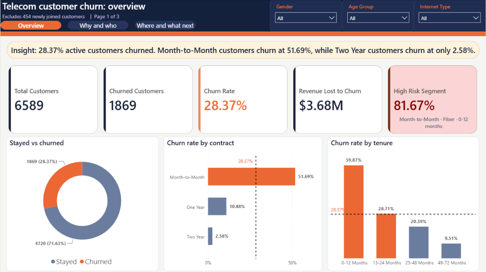
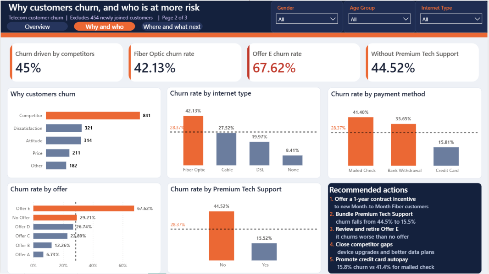
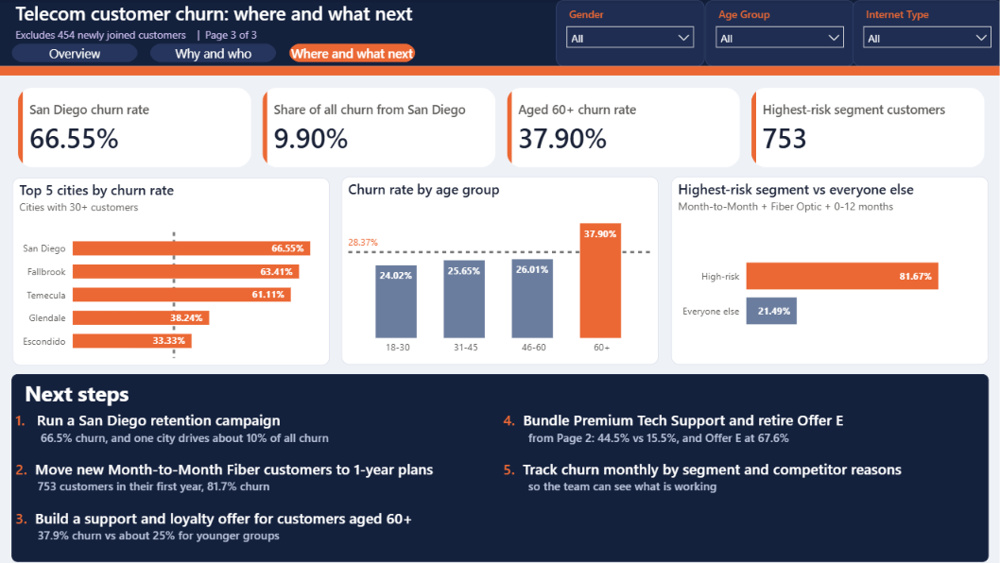

# Telecom Customer Churn Analysis

End-to-end analysis of why telecom customers leave: **Python → MySQL → SQL → Power BI**, ending in business recommendations.

## About this project
I wanted one project that covers the whole analyst workflow, from messy raw data to a recommendation someone could act on, instead of just making a few charts.

The hardest part was keeping the numbers consistent. Once I decided to leave out the 454 customers who had just joined, I had to apply that rule in SQL and on every Power BI page. I missed it on one page, and San Diego showed 64.91% instead of 66.55%. Checking my page against my SQL results is how I caught it.

What I learned: define the metric first, be careful with small groups (so the city chart only shows cities with 30+ customers), and remember that these findings show patterns, not proof of cause. The recommendations should be tested before a full rollout.

## Key result
**28.37% churn** (1,869 of 6,589 customers), about **$3.68M revenue lost**. The highest-risk group (Month-to-Month + Fiber Optic + first 12 months) churns at **81.67%**.
Full findings: [insights_and_recommendations.md](insights_and_recommendations.md)

## Dashboard
| Overview | Why and who | Where and what next |
|---|---|---|
|  |  |  |

## Data
The dataset is the [Telecom Customer Churn dataset](https://mavenanalytics.io/data-playground/telecom-customer-churn) from Maven Analytics' Data Playground (listed there as Public Domain; original source: IBM Cognos Analytics). It contains 7,043 customers plus a zip code population table.

## Pipeline
1. **Clean (Python, pandas)** – `notebooks/churn_analysis.ipynb` cleans the raw data and exports `telecom_churn_cleaned.csv` (7,043 rows).
2. **Load (MySQL)** – the cleaned data is loaded into a MySQL table from the notebook.
3. **Analyse (SQL)** – `sql/analysis_queries.sql` answers the business questions (churn by contract, tenure, city, offer, and so on).
4. **Visualise (Power BI)** – `dashboard/telecom_churn.pbix` is built from the cleaned CSV (3 pages).
5. **Recommend** – `insights_and_recommendations.md`.

## Important definition
Customers with status **"Joined"** (454) are **excluded from churn rate**, since they joined too recently to have churned. The cleaned data and the MySQL table keep all 7,043 rows. The exclusion is applied in SQL (`WHERE customer_status <> 'Joined'`) and in Power BI (page filter).

## Project structure
```
data/          raw data, cleaned CSV, data dictionary
notebooks/     churn_analysis.ipynb
sql/           analysis_queries.sql
dashboard/     telecom_churn.pbix, screenshots/
```

## How to run
1. `pip install pandas sqlalchemy pymysql jupyter`
2. Open `notebooks/churn_analysis.ipynb` and set your MySQL details in the config cell (`DB_PASSWORD` is a placeholder, use your own and never commit it).
3. Run the notebook, then run `sql/analysis_queries.sql` in MySQL.
4. Open `dashboard/telecom_churn.pbix` in Power BI Desktop (if asked, point it to `data/telecom_churn_cleaned.csv`).

## Tools
Python (pandas), MySQL, SQL, Power BI (DAX).
